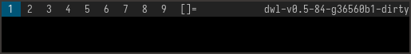

### Description

Add a bar identical to dwm's bar.

To use a status-bar, you can pass in status text via stdin:
```
slstatus -s | dwl
```

### Dependencies
* tllist (build dependency, required & pulled automatically by fcft)
* fcft
* pixman

### Download
- [git branch](https://codeberg.org/sewn/dwl/src/branch/bar)
- [2024-06-27](https://codeberg.org/dwl/dwl-patches/raw/branch/main/patches/bar/bar.patch)

Below is a preview of the patch.



For colors, they are in `RRRR, GGGG, BBBB, AAAA` format due to inheriting the `pixman_color_t` type, an example for the color `0x282a36` would be `0x2828, 0x2a2a, 0x3636, 0xffff`

### Authors
- [sewn](https://codeberg.org/sewn)

### Credits
- [MadcowOG](https://github.com/MadcowOG)
- [kolumni](https://github.com/kolunmi/dwlb)

